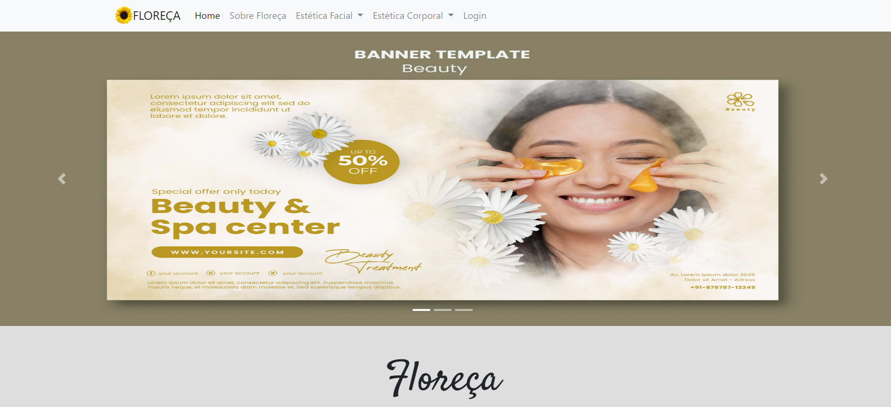

<h1 align="center">Floreça</h1>

 

 Floreça foi criado e desenvolvido como projeto integrador durante a conclusão do meu curso Programação web na Instituição Senac.

 

## 💻 Projeto

Floreça é um site de estética que nasceu pelo desejo de uma das alunas esteticista ter seu próprio site. 

## 🎯 Desafio

### Os usuários devem ser capazes de:
- Enviar solicitação de consulta
- Pesquisar sobre procedimentos

### Os funcionários devem ser capazes de:
- Realizar login de administrador
- Cadastro de funcionários e clientes
- Cadastro de procedimentos e serviços
- Cancelar consultas e serviços
- Finalizar serviços

## 📸 Captura de tela

 

## 🚀 Construído com
- HTML e CSS
- PHP
- BootStrap
- MySQL

## 🤓 Desenvolvedor

- LinkedIn - [Driely Santos](https://www.linkedin.com/in/driely-santos98/)
- Em grupo

## Projeto em andamento

